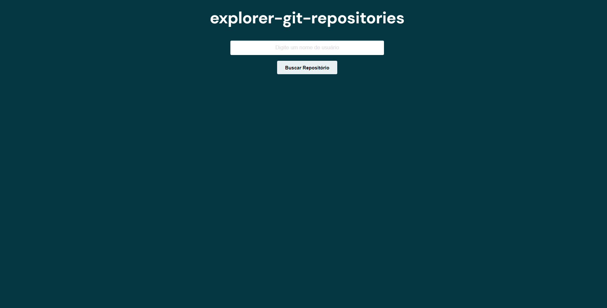
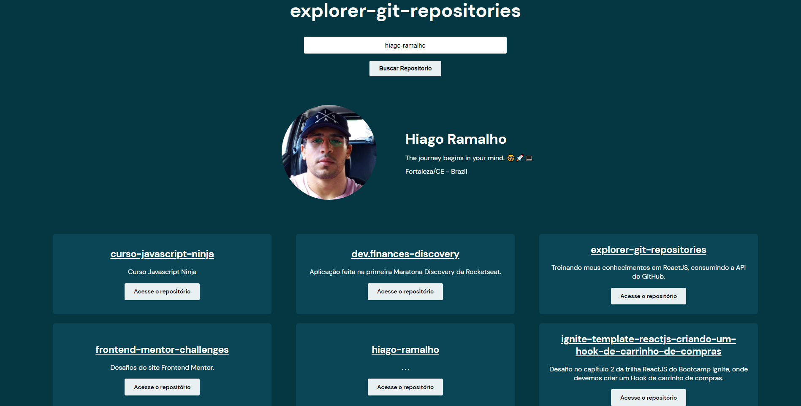

# explorer-git-repositories

Treinando meus conhecimentos em JavaScript, ReactJS, Html e Css consumindo a API do GitHub com Ajax.

   

## Tecnologias usadas:

- HTML
- CSS
- Responsividade usando Media Queries
- JavaScript
- ReactJS
- Ajax

## Funcionalidades:

- Ao digitar o nome de um usuário válido, a aplicação irá retornar:
  - Um header com o avatar, nome, bio, empresa e localidade do usuário;
  - O nome do usuário é um link para o perfil do mesmo no GitHub;
  - Retorna todos os repositórios públicos do usuário com:
    - Nome do repositório;
    - Descrição do repositório;
    - Botão com link que direciona diretamente para o repositório.
- Ao digitar um usuário inválido:
  - Irá retornar uma mensagem informando que o usuário não exite;
  - A página dará um reload.
